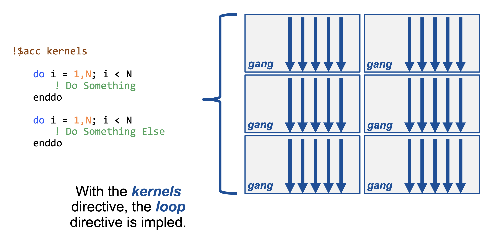
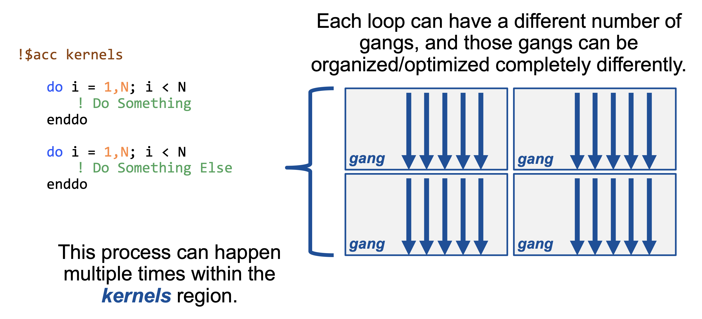

# Using the OpenACC Kernels Directive

In the [main part](README.md) of this lab you learned how to use the `acc parallel loop` directive to accelerate a simple application on multicore CPUs and GPUs. The `acc parallel loop` directive is really nice, because it's simple to understand what it does: it begins parallel execution and it runs the following loop in parallel. This works great if I'm sure I know which loops can and should be parallelized, but what if I'm not sure? As an alternative, OpenACC provides the `acc kernels` directive, which essentially states that the contained region of code is potentially interesting, but needs more analysis. It's then up to the compiler to decide whether the loops in that region can and should be parallelized for the processor you're targeting. Here's hou

## Kernels Directive

The kernels directive allows the programmer to step back, and rely solely on the compiler. Let's look at the syntax:

```fortran
!$acc kernels
do i = 1, N
    < loop code >
end do
!$acc end kernels
```

Just like in the parallel directive example, we are parallelizing a single loop. Recall that when using the parallel directive, it must always be paired with the loop directive, otherwise the code will be improperly parallelized. The kernels directive does not follow the same rule, and in some compilers, adding the loop directive may limit the compilers ability to optimize the code.

As said previously, the kernels directive is the exact opposite of the parallel directive. This means that the compiler is making a lot of assumptions, and may even override the programmers decision to parallelize code. Also, by default, the compiler will attempt to optimize the loop. The compiler is generally pretty good at optimizing loops, and sometimes may be able to optimize the loop in a way that the programmer cannot describe. However, usually, the programmer will be able to achieve better performance by optimizing the loop themself.

If you run into a situation where the compiler refuses to parallelize a loop, you may override the compilers decision. (however, keep in mind that by overriding the compilers decision, you are taking responsibility for any mistakes the occur from parallelizing the code!) In this code segment, we are using the independent clause to ensure the compiler that we think the loop is parallelizable.

```fortran
!$acc kernels loop independent
do i = 1, N
    < loop code >
end do
```

One of the largest advantages of the kernels directive is its ability to parallelize many loops at once. For example, in the following code segment, we are able to effectively parallelize two loops at once by utilizing a kernels region (similar to a parallel region, that we saw earlier.)

```fortran
!$acc kernels
    do i = 1, N
        < loop code >
    end do
    
    < some other sequential code >
    
    do j = 1, N
        < loop code >
    end do
!$acc end kernels
```

By using the kernels directive, we can parallelize more than one loop (as many loops as we want, actually.) We are also able to include sequential code between the loops, without needing to include multiple directives. Similar to before, let's look at a visual example of how the kernels directive works.




OK, now it's your turn to try the `kernels` approach. Open [laplace2d.f90](laplace2d.f90) again and replace your `acc parallel loop` directives with `acc kernels` and rerun the code. Don't forget to save the code after making edits.


```bash
$ pgfortran -fast -ta=tesla:managed -Minfo=accel -o laplace laplace2d.f90 jacobi.f90 && echo "Compilation Successful!" && ./laplace
```

    laplace2d.f90:
    calcnext:
         58, Generating implicit copyout(anew(1:n-2,1:m-2)) [if not already present]
             Generating implicit copyin(a(:n-1,:m-1)) [if not already present]
         59, Loop is parallelizable
         60, Loop is parallelizable
             Generating Tesla code
             59, !$acc loop gang, vector(4) ! blockidx%y threadidx%y
             60, !$acc loop gang, vector(32) ! blockidx%x threadidx%x
             63, Generating implicit reduction(max:error)
    swap:
         77, Generating implicit copyin(anew(1:n-2,1:m-2)) [if not already present]
             Generating implicit copyout(a(1:n-2,1:m-2)) [if not already present]
         78, Loop is parallelizable
         79, Loop is parallelizable
             Generating Tesla code
             78, !$acc loop gang, vector(4) ! blockidx%y threadidx%y
             79, !$acc loop gang, vector(32) ! blockidx%x threadidx%x
    jacobi.f90:
    Compilation Successful!
    Jacobi relaxation Calculation: 4096 x 4096 mesh
        0  0.250000
      100  0.002397
      200  0.001204
      300  0.000804
      400  0.000603
      500  0.000483
      600  0.000403
      700  0.000345
      800  0.000302
      900  0.000269
     completed in      1.373 seconds


We should see similar performance to the previous version, but for some reason we don't. Let's see if the compiler output tells us anything.

```
calcnext:
     58, Generating implicit copyout(anew(1:n-2,1:m-2))
         Generating implicit copyin(a(:n-1,:m-1))
     59, Loop is parallelizable
     60, Loop is parallelizable
         Accelerator kernel generated
         Generating Tesla code
         59, !$acc loop gang, vector(4) ! blockidx%y threadidx%y
         60, !$acc loop gang, vector(32) ! blockidx%x threadidx%x
         63, Generating implicit reduction(max:error)
```

You should now see the performance back where it was previously. Notice that you did not need to identify the reduction on the variable `error` like you did with `parallel loop`. When using the `kernels` directive it is the compiler's responsibility to ensure that a loop is safe to parallelize, rather than the programmer, so the PGI compiler detects and implicitly handles the reduction in cases like this one. If the performance or answers look wrong, feel free to take a peek at [our solution](solutions/laplace2d.kernels.f90).

## Conclusions

Let's recap the two approaches OpenACC provides for parallelizing your application.

* The `parallel loop` directive gives a lot of control to the programmer. The programmer decides what to parallelize, and how it will be parallelized. Any mistakes made by the parallelization is at the fault of the programmer. It is recommended to use a `parallel loop` directive for each loop you want to parallelize.

* The `kernels` directive leaves majority of the control to the compiler. The compiler will analyze the loops, and decide which ones to parallelize. It may refuse to parallelize certain loops, but the programmer can override this decision. You may use the kernels directive to parallelize large portions of code, and these portions may include multiple loops.

So which approach should you use in your application? It's really mostly personal preference. The `kernels` directive is nice because when it works properly it requires very little thought by the programmer, but if the compiler is at all unsure about whether a loop is safe to parallelize it will not parallelize that loop. On the other hand, the compiler will always parallelize loops with the `parallel loop` directive, because the programmer has promised that it's safe to do so. At the end of the day, for most loops it's possible to get very similar performance using either approach, so you should use the one that you feel most comfortable and productive with.
