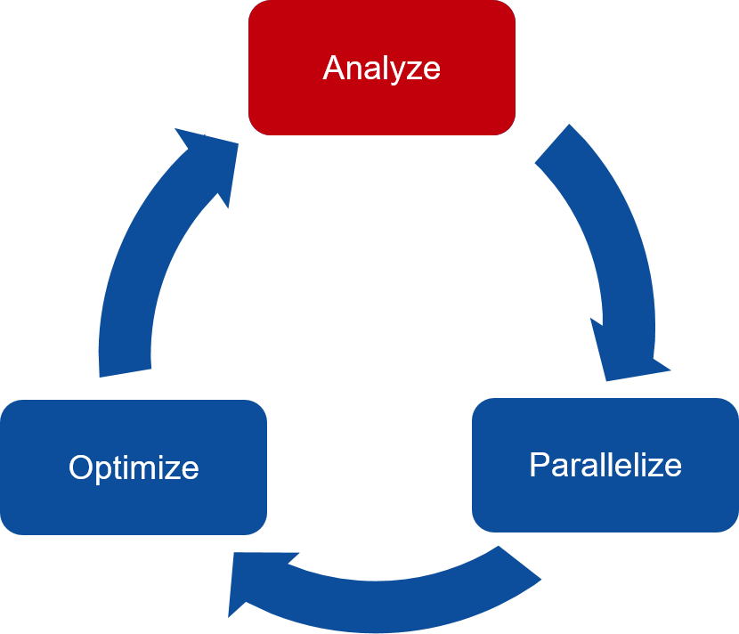
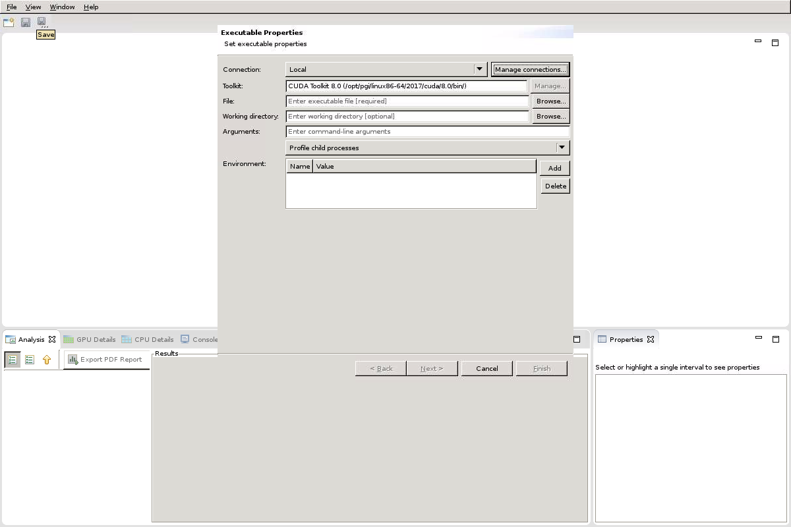
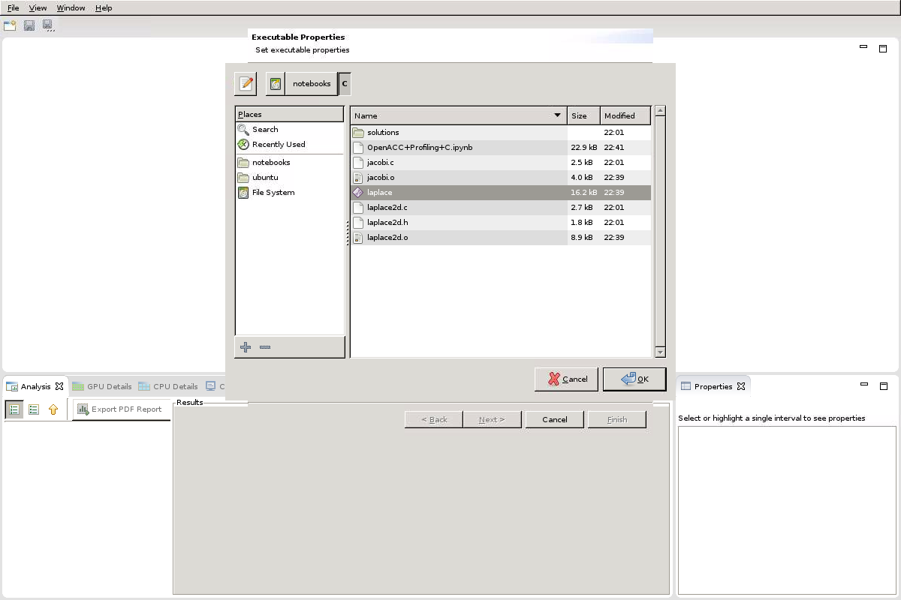
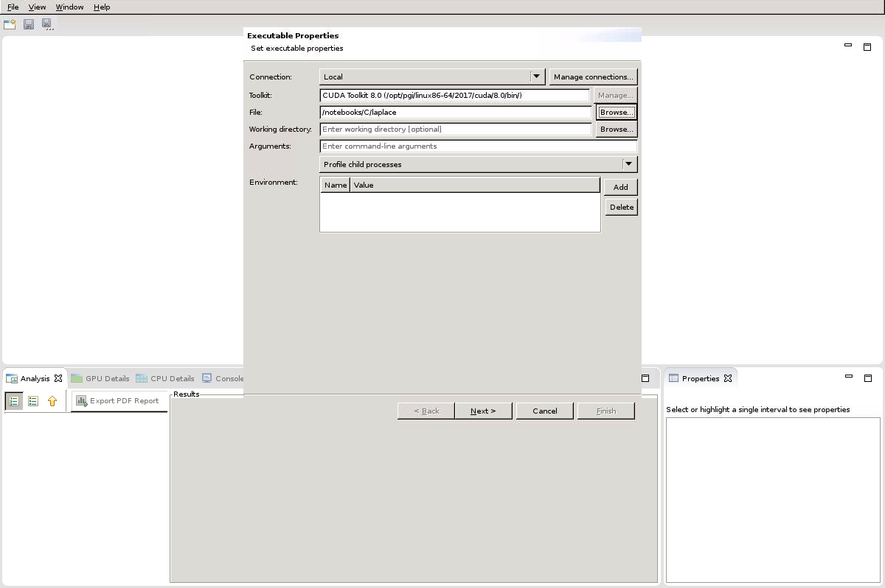
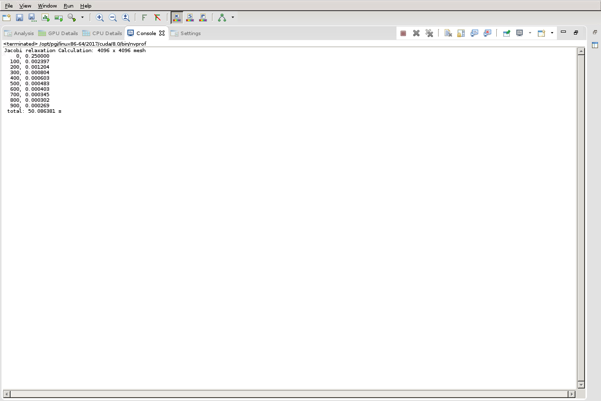
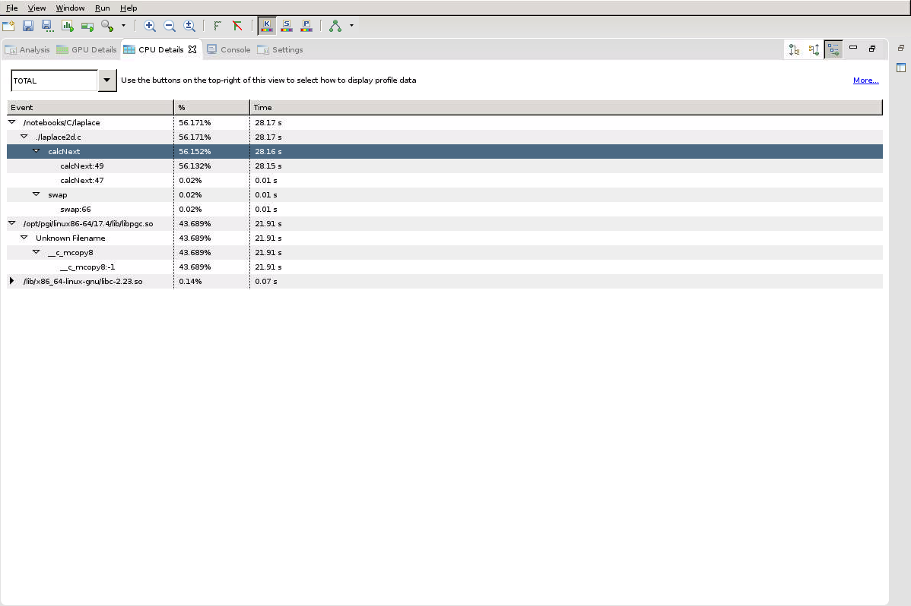
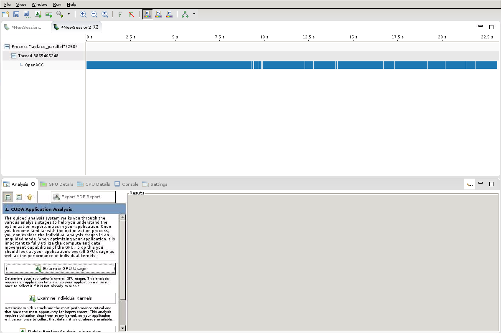
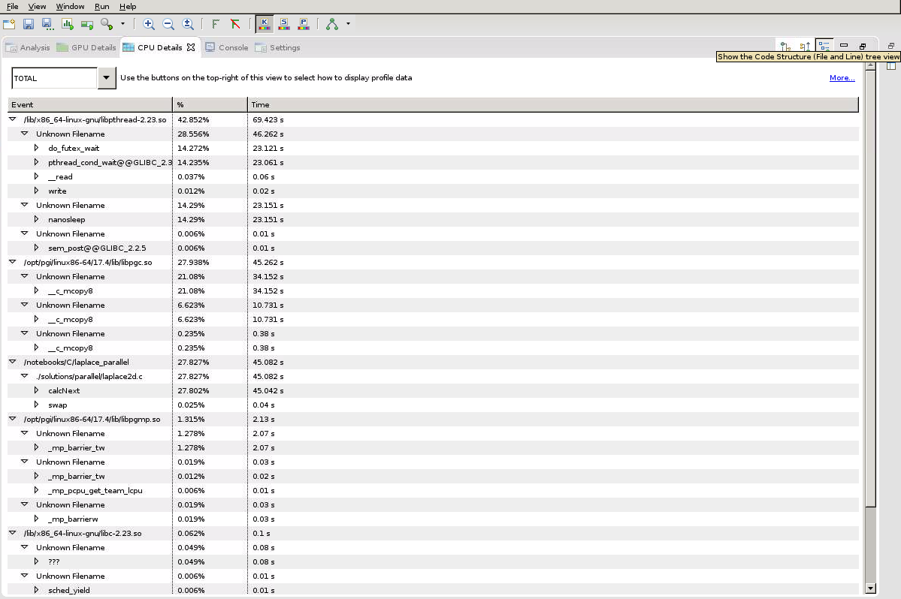
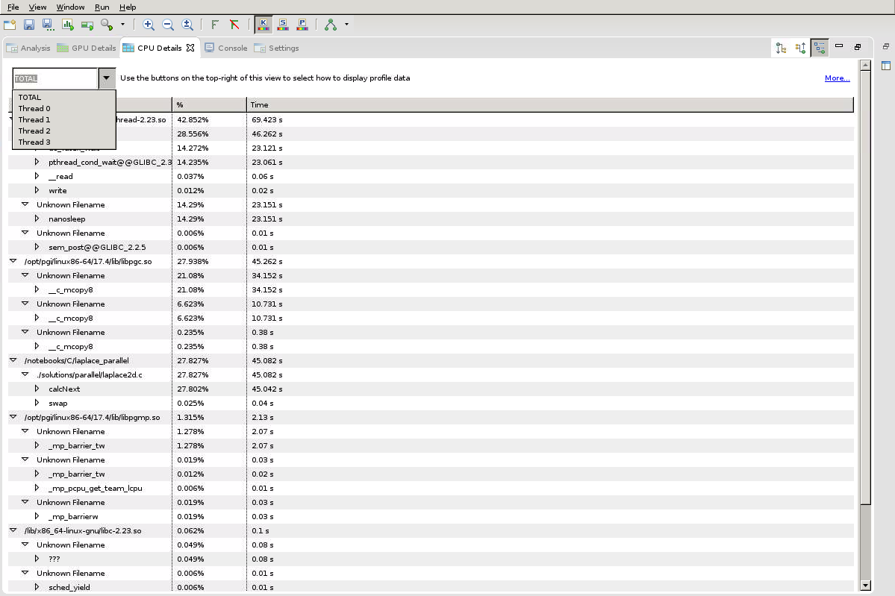
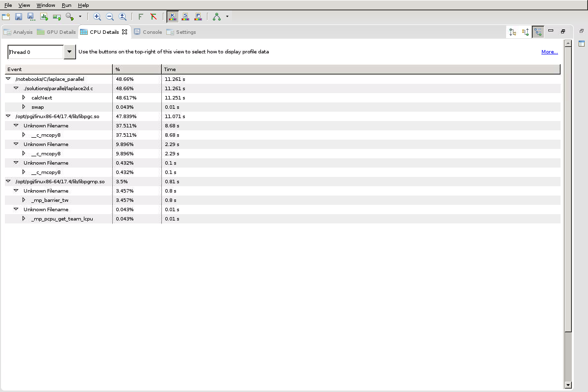

# Profiling OpenACC Code

This lab is intended for C/C++ programmers. If you prefer to use Fortran, click [this link.](../Fortran/README.md)

You will receive a warning five minutes before the lab instance shuts down. At this point, make sure to save your work! If you are about to run out of time, please see the [Post-Lab](#Post-Lab-Summary) section for saving this lab to view offline later.

---
Let's execute the cell below to display information about the GPUs running on the server by running the `pgaccelinfo` command, which ships with the PGI compiler that we will be using. To do this, execute the cell block below by giving it focus (clicking on it with your mouse), and hitting Ctrl-Enter, or pressing the play button in the toolbar above.  If all goes well, you should see some output returned below the grey cell.


```sh
!pgaccelinfo
```

---
## Introduction

Our goal for this lab is to learn what exactly code profiling is, and how we can use it to help us write powerful parallel programs.  
  
  
  


This is the OpenACC 3-Step development cycle.

**Analyze** your code to determine most likely places needing parallelization or optimization.

**Parallelize** your code by starting with the most time consuming parts and check for correctness.

**Optimize** your code to improve observed speed-up from parallelization.

We are currently tackling the **analyze** step. We will use PGI's code profiler (PGProf) to get an understanding of a relatively simple sample code before moving onto the next two steps.

---

## Run the Code

Our first step to analyzing this code is to run it. We need to record the results of our program before making any changes so that we can compare them to the results from the parallel code later on. It is also important to record the time that the program takes to run, as this will be our primary indicator to whether or not our parallelization is improving performance.

### Compiling the Code with PGI

We are using the PGI compiler to compiler our code. You will not need to memorize the compiler commands to complete this lab, however, they will be helpful to know if you want to parallelize your own personal code with OpenACC.

**pgcc**      : this is the command to compile C code  
**pgc++**     : this is the command to compile C++ code  
**pgfortran** : this is the command to compile Fortran code  
**-fast**     : this compiler flag will allow the compiler to perform additional optimizations to our code


```sh
!pgcc -fast -o laplace jacobi.c laplace2d.c && echo "Compilation Successful!" && ./laplace
```

### Understanding Code Results

The output from our program will make more sense as we analyze the code. The most important thing to keep in mind is that we need these output values to stay consistent. If these outputs change during any point while we parallelize our code, we know we've made a mistake. For simplicity, focus on the last output, which occurred at iteration 900. It is also helpful to record the time the program took to run. Our goal while parallelizing the code is ultimately to make it faster, so we need to know our "base runtime" in order to know if the code is running faster.

---

## Analyze the Code

Now that we know how long the code took to run and what the code's output looks like, we should be able to view the code with a decent idea of what is happening. The code is contained within two files, which you may open and view.

[jacobi.c](jacobi.c)  
[laplace2d.c](laplace2d.c)  
  
You may read through these two files on your own, but we will also highlight the most important parts below in the "Code Breakdown".

### Code Description

The code simulates heat distribution across a 2-dimensional metal plate. In the beginning, the plate will be unheated, meaning that the entire plate will be room temperature. A constant heat will be applied to the edge of the plate and the code will simulate that heat distributing across the plate over time.  

This is a visual representation of the plate before the simulation starts:  
  
  
  
We can see that the plate is uniformly room temperature, except for the top edge. Within the [laplace2d.c](../../../edit/01-Profiling-OpenACC-Code/C/laplace2d.c) file, we see a function called **`initialize`**. This function is what "heats" the top edge of the plate. 
  
```
void initialize(double *restrict A, double *restrict Anew, int m, int n)  
{  
    memset(A, 0, n * m * sizeof(double));  
    memset(Anew, 0, n * m * sizeof(double));  
  
    for(int i = 0; i < m; i++){  
        A[i] = 1.0;  
        Anew[i] = 1.0;  
    }  
}  
```

After the top edge is heated, the code will simulate the heat distributing across the length of the plate. We will keep the top edge at a constant heat as the simulation progresses.

This is the plate after several iterations of our simulation:  
  
 

That's the theory: simple heat distribution. However, we are more interested in how the code works. 

### Code Breakdown

The 2-dimensional plate is represented by a 2-dimensional array containing double-precision floating point values. These doubles represent temperature; 0.0 is room temperature, and 1.0 is our max temperature. The 2-dimensional plate has two states, one represents the current temperature, and one represents the expected temperature values at the next step in our simulation. These two states are represented by arrays **`A`** and **`Anew`** respectively. The following is a visual representation of these arrays, with the top edge "heated".

  
    
Simulating this state in two arrays is very important for our **`calcNext`** function. Our calcNext is essentially our "simulate" function. calcNext will look at the inner elements of A (meaning everything except for the edges of the plate) and update each elements temperature based on the temperature of its neighbors.  If we attempted to calculate in-place (using only **`A`**), then each element would calculate its new temperature based on the updated temperature of previous elements. This data dependency not only prevents parallelizing the code, but would also result in incorrect results when run in serial. By calculating into the temporary array **`Anew`** we ensure that an entire step of our simulation has completed before updating the **`A`** array.

  

Below is the **`calcNext`** function:
```
01 double calcNext(double *restrict A, double *restrict Anew, int m, int n)
02 {
03     double error = 0.0;  
04     for( int j = 1; j < n-1; j++)  
05     {  
06        for( int i = 1; i < m-1; i++ )   
07        {  
08            Anew[OFFSET(j, i, m)] = 0.25 * ( A[OFFSET(j, i+1, m)] + A[OFFSET(j, i-1, m)]  
09                                           + A[OFFSET(j-1, i, m)] + A[OFFSET(j+1, i, m)]);  
10            error = fmax( error, fabs(Anew[OFFSET(j, i, m)] - A[OFFSET(j, i , m)]));  
11        }  
12    }  
13    return error;  
14 }  
```

We see on lines 07 and 08 where we are calculating the value of **`Anew`** at **`i,j`** by averaging the current values of its neighbors. Line 09 is where we calculate the current rate of change for the simulation by looking at how much the **`i,j`** element changed during this step and finding the maximum value for this **`error`**. This allows us to short-circuit our simulation if it reaches a steady state before we've completed our maximum number of iterations.

Lastly, our **`swap`** function will copy the contents of **`Anew`** to **`A`**.

```
01 void swap(double *restrict A, double *restrict Anew, int m, int n)
02 {	
03    for( int j = 1; j < n-1; j++)
04    {
05        for( int i = 1; i < m-1; i++ )
06        {
07            A[OFFSET(j, i, m)] = Anew[OFFSET(j, i, m)];    
08        }
09    }
10 }
```

---

## Profile the Code

By now you should have a good idea of what the code is doing. If not, go spend a little more time in the previous sections to ensure you understand the code before moving forward. Now it's time to profile the code to get a better understanding of where the application is spending its runtime. To profile our code we will be using PGPROF, which is a visual profiler that comes with the PGI compiler. You can run PGPROF through noVNC by <a href="/vnc" target="_blank">clicking this link</a>.

We will start by profiling the laplace executable that we created earlier. To do this, Select File > New Session. After doing this you should see a pop-up like the one in the picture below.

 

Then where is says "File: Enter Executable File [required]", select "Browse". Then select File Systems > Notebooks > C.

 

Select our "laplace" executable file. 



Then select "Next", followed by "Finished". 

 

Our Laplace code will run again. We will know when it's finished running (about a minute) when we see our output in the Console Tab. 

 

Since our application is run entirely on the CPU, select the CPU Details Tab towards the bottom of the window. At the top right of the tab, their are three options. These options are different ways to organize the CPU Details. I have selected "Hierarchy".  

 

Within the CPU Details Tab we can see the time that each individual portion of our code took to run. This information is important because it allows us to make educated decisions about which parts of our code to optimize first. To get the bang for our buck, we want to focus on the most time-consuming parts of the code. Next, we will compiler, run, and profile a parallel version of the code, and analyze the differences.


### Optional - Where is the c_mcopy8 coming from?

When we compiled our code earlier, we omitted any sort of compiler feedback. It turns out that even with a sequential code, the compiler is performing a lot of optimizations. If you compile the code again with the **`-Minfo=opt`** flag, which instructs  the compiler to print additional information how it optimized the code, then it will become more obvious where this strange routine came from.. Afterwards, you should see that the **`c_mcopy8`** is actually an optimzation that is being applied to the **`swap`** function. Notice in the output below that at line 64 of **`laplace2d.c`**, which happens inside the **`swap`** routine, that the compiler determined that our loops are performing a memory copy, which it believes can be performed more efficiently by calling the **`c_mcopy8`** function instead.

```
laplace2d.c:
swap:
     63, Memory copy idiom, loop replaced by call to __c_mcopy8
```


```sh
!pgcc -fast -Minfo=opt -o laplace jacobi.c laplace2d.c
```

---

## Run Our Parallel Code on Multicore CPU

In a future lab you will run parallelize the code to run on a multicore CPU. This is the simplest starting point, since it doesn't require us to think about copying our data between different memories. So that you can experience profiling with PGProf on a multicore CPU, a parallel version of the code has been provided. You will be able to parallelize the code yourself in the next lab.


```sh
!pgcc -fast -ta=multicore -Minfo=accel -o laplace_parallel ./solutions/parallel/jacobi.c ./solutions/parallel/laplace2d.c && ./laplace_parallel
```

### Compiling Multicore Code using PGI

Again, you do not need to memorize the compiler commands to complete this lab. Though, if you want to use OpenACC with your own personal code, you will want to learn them.

**-ta** : This flag will tell the compiler to compile our code for a specific parallel hardware. TA stands for "Target Accelerator", an accelerator being any device that accelerates performance (in our case, this means parallel hardware.) Omitting the -ta flag will cause the code to compile sequentially.  
**-ta=multicore** will tell the compiler to parallelize the code specifically for a multicore CPU.  
**-Minfo** : This flag will tell the compiler to give us some feedback when compiling the code.  
**-Minfo=accel** : will only give us feedback about the parallelization of our code.  
**-Minfo=opt** : will give us feedback about sequential optimizations.  
**-Minfo=all** : will give all feedback; this includes feedback about parallelizaiton, sequential optimizations, and even parts of the code that couldn't be optimized for one reason or another.  

If you would like to see the c_mcopy8 from earlier, try switching the Minfo flag with **-Minfo=accel,opt**.

---

## Profiling Multicore Code

Using the same PGProf window as before, start a new session by selecting File > New Session. Follow the steps from earlier to profile the code with PGPROF, however, select the **`laplace_parallel`** executable this time instead of **`laplace`**. If you have closed the noVNC client, you can reopen it by <a href="/vnc" target="_blank">clicking this link</a>.

This is the view that we are greeted with when profiling a multicore application.



The first difference we see is the blue "timeline." This timeline represents when our program is executing something on the parallel hardware. This means that every call to **`calcNext`** and **`swap`** should be represented by a blue bar. Since we are running on a multicore CPU, all of our information will be found in the CPU Details Tab.



We can see that our CPU Details is much more complicated than with the sequential program. We will not cover everything that is happening within these CPU details (though, it is all great information if you want to do some external research); for the most part, these additional functions are handling the communication between the CPU cores.

Among the new CPU details, we also see our **`calcNext`** and **`c_mcopy8`** functions again. And at first glance, it seems that they are taking significantly longer than they were before. This is strange, because it is obvious to see that our program runtime has descreased significantly. This discrepancy is due to the fact that the our parallel program is now running across *multiple threads* and the profiler is showing the aggregate runtime of all threads.

A thread is simply a computational unit; something that can run computer instructions. Specifically, our CPU is utilizing 4 threads, since it has 4 CPU cores on which to run. At the top-left-hand corner of the CPU Details tab, you will see a dropdown box labeled **TOTAL**. This means that currently, the CPU Details is combining information about all of our threads. This is not a fair representation, because these threads can run independently of each other, meaning they will run simultaneously. Let's look at a single thread, rather than the TOTAL view.  




Looking at a single thread, we can see that **`calcNext`** and **`c_mcopy8`** are taking significantly less time to run. When I ran the code, my **Thread 0** is reporting to have spent about 11 seconds running **`calcNext`**. This is significantly faster than earlier. However, when looking at the **TOTAL** view, it was reporting that all of the threads combined were spending 45 seconds running calcNext. This means that each thread spent around 11 second running calcNext, and once you added them all together, it totaled to be 45 seconds. This **TOTAL** view does not take into consideration that all of these threads are running **simultaneously**. So, when you add up all of their times together, it is about 45 seconds. But since they ran at the same time, the realistic time would be around 11 seconds. Notice that the runtime reported at the end of the simulation is more similar to the time of an individual thread than it is the time displayed in the **TOTAL** view.

This is the main idea behind parallel programming. When you consider the **TOTAL** computation time, it will take almost equivalent time to our sequential program, however the application runtime decreases due to the fact that we can now execute portions of our code in parallel by spreading the work across multiple threads.

---

## Conclusion

Now we have a good understanding of how our program is running, and which parts of the program are time consuming. In the next lab, we will parallelize our program using OpenACC.

We are working on a very simple code that is specifically used for teaching purposes. Meaning that, in terms of complexity, it can be fairly underwhelming. Profiling code will become exponentially more useful if you chose to work on a "real-world" code; a code with possibly hundreds of functions, or millions of lines of code. Profiling may seem trivial when we only have 4 functions, and our entire code is contained in only two files, however, profiling will be one of your greatest assets when parallelizing real-world code.

---

## Bonus Task

For right now, we are focusing on multicore CPUs. Eventually, we will transition to GPUs. If you are familiar with GPUs, and would like to play with a GPU profile, then feel free to try this bonus task. If you do not want to complete this task now, you will have an opportunity in later labs (where we will also explain more about what is happening.)

Run this script to compile/run our code on a GPU.


```sh
!pgcc -fast -ta=tesla:cc30 -Minfo=accel -o laplace_gpu ./solutions/gpu/jacobi.c ./solutions/gpu/laplace2d.c && ./laplace_gpu
```

Now, within PGPROF, select File > New Session. Follow the same steps as earlier, except select the **`laplace_gpu`** executable. If you closed the noVNC window, you can reopen it by <a href="/vnc" target="_blank">clicking this link</a>.

Happy profiling!

---

