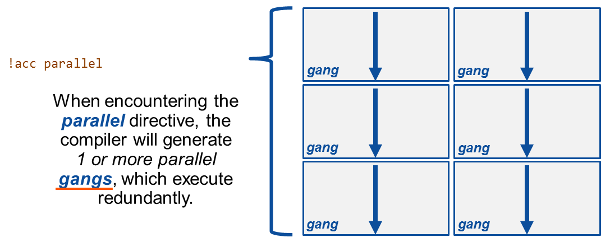
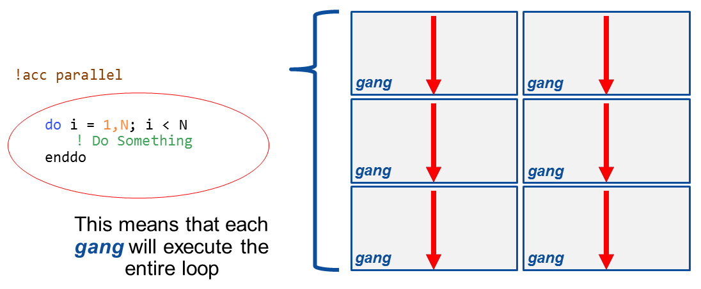
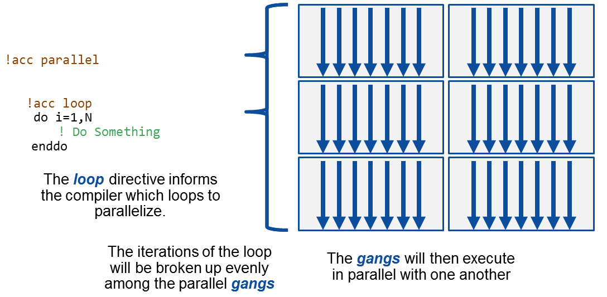
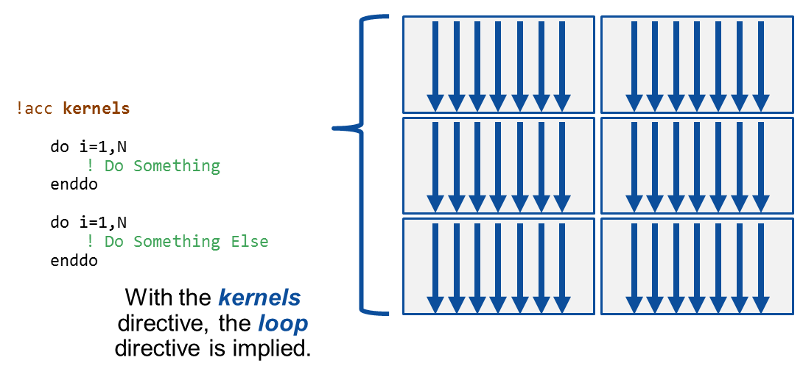
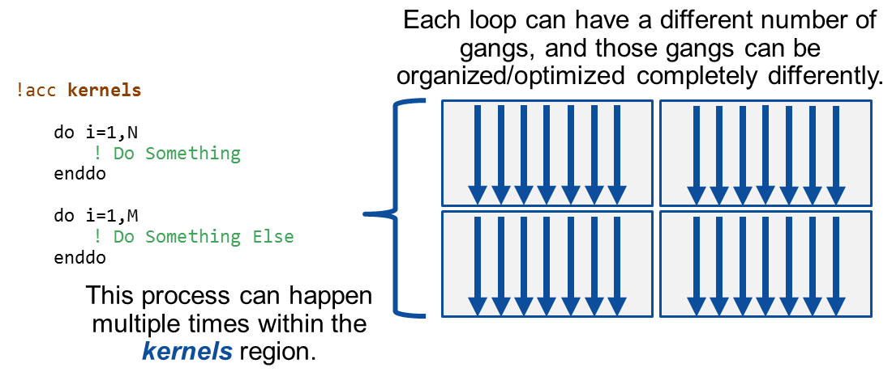

# OpenACC Directives

This version of the lab is intended for Fortran programmers. The C/C++ version of this lab is available [here](../C/README.md).

The following timer counts down to a five minute warning before the lab instance shuts down.  You should get a pop up at the five minute warning reminding you to save your work!  If you are about to run out of time, please see the [Post-Lab](#Post-Lab-Summary) section for saving this lab to view offline later. This is the Fortran version of this lab, for the C version [click here](../C/README.md).

Don't forget to check out additional [OpenACC Resources](https://www.openacc.org/resources) and join our [OpenACC Slack Channel](https://www.openacc.org/community#slack) to share your experience and get more help from the community.

---
Let's execute the cell below to display information about the GPUs running on the server. To do this, execute the cell block below by giving it focus (clicking on it with your mouse), and hitting Ctrl-Enter, or pressing the play button in the toolbar above.  If all goes well, you should see some output returned below the grey cell.


```bash
$ pgaccelinfo
```

---

## Introduction

Our goal for this lab is to learn what exactly code profiling is, and how we can use it to help us write powerful parallel programs.  
  
  
  


This is the OpenACC 3-Step development cycle.

**Analyze** your code, and predict where potential parallelism can be uncovered. Use profiler to help understand what is happening in the code, and where parallelism may exist.

**Parallelize** your code, starting with the most time consuming parts. Focus on maintaining correct results from your program.

**Optimize** your code, focusing on maximizing performance. Performance may not increase all-at-once during early parallelization.

We are currently tackling the **analyze** step. We will use PGI's code profiler to get an understanding of a relatively simple sample code before moving onto the next two steps.

## Run the Code

Our first step to analyzing this code is to run it. We need to record the results of our program before making any changes so that we can compare them to the results from the parallel code later on. It is also important to record the time that the program takes to run, as this will be our primary indicator to whether or not our parallelization is improving performance.


```bash
$ pgfortran -fast -o laplace laplace2d.f90 jacobi.f90 && echo "Compilation Successful!" && ./laplace
```

### Optional: Analyze the Code

If you would like a refresher on the code files that we are working on, you may view both of them using the two links below.

[jacobi.f90](../Fortran/jacobi.f90)  
[laplace2d.f90](../Fortran/laplace2d.f90)  

### Optional: Profile the Code

If you would like to profile the sequential code, you may select <a href="/vnc" target="_blank">this link.</a> When prompted for a password, type `openacc`. This will open a noVNC window, then you may use PGPROF to profile our sequential laplace code. The executable will be found in the `/home/openacc/labs/module3/English/Fortran` directory.

---

## OpenACC Directives

Using OpenACC directives will allow us to parallelize our code without needing to explicitly alter our code. What this means is that, by using OpenACC directives, we can have a single code that will function as both a sequential code and a parallel code.

### OpenACC Syntax

`!$acc <directive> <clauses>`

`!$acc` in Fortran is what's known as a "compiler directive." These are very similar to programmer comments, since the line begins with a comment statement `!`. After the comment is `$acc`. OpenACC compliant compilers with appropriate command line options can interpret this as an OpenACC directive that "guide" the compiler, without running the chance of damaging the code. If the compiler does not understand `!$acc` it can ignore it, rather than throw a syntax error because it's just a comment.

**directives** are instructions in OpenACC that will tell the compiler to do some action. For now, we will only use directives that allow the compiler to parallelize our code.

**clauses** are additions/alterations to our directives. These include (but are not limited to) optimizations. The way that I prefer to think about it: directives describe a general action for our compiler to do (such as, paralellize our code), and clauses allow the programmer to be more specific (such as, how we specifically want the code to be parallelized).


---
### Parallel Directive

There are three directives we will cover in this lab: parallel, kernels, and loop. Once we understand all three of them, you will be tasked with parallelizing our laplace code with your preferred directive (or use all of them, if you'd like!)

The parallel directive may be the most straight-forward of the directives. It will mark a region of the code for parallelization (this usually only includes parallelizing a single for loop.) Let's take a look:

```fortran
    !$acc parallel loop
    do i=1,N
        < loop code >
    enddo
```

We may also define a "parallel region". The parallel region may have multiple loops (though this is often not recommended!) The parallel region is everything contained within the outer-most loop.

```fortran
!$acc parallel
    !$acc loop
    do i=1,N
        < loop code >
    enddo

```

`!$acc parallel loop` will mark the next loop for parallelization. It is extremely important to include the **`loop`**, otherwise you will not be parallelizing the loop properly. The parallel directive tells the compiler to "redundantly parallelize" the code. The `loop` directive specifically tells the compiler that we want the loop parallelized. Let's look at an example of why the loop directive is so important.





We are soon going to move onto the next directive (the kernels directive) which also allows us to parallelize our code. We will also mark the differences between this two directives. With that being said, the following information is completely unique to the parallel directive:

The parallel directive leaves a lot of decisions up to the programmer. The programmer will decide what is, and isn't, parallelizable. The programmer will also have to provide all of the optimizations - the compiler assumes nothing. If any mistakes happen while parallelizing the code, it will be up to the programmer to identify them and correct them.

We will soon see how the kernels directive is the exact opposite in all of these regards.

### Optional: Parallelize our Code with the Parallel Directive

It is recommended that you learn all three of the directives prior to altering the laplace code. However, if you wish to try out the parallel directive *now*, then you may use the following links to edit the laplace code.

[jacobi.f90](../Fortran/jacobi.f90)   
[laplace2d.f90](../Fortran/laplace2d.f90)  

(be sure to save the changes you make by pressing ctrl+s)

You may run your code by running the following script:


```bash
$ pgfortran -fast -ta=multicore -Minfo=accel -o laplace_parallel laplace2d.f90 jacobi.f90 && ./laplace_parallel
```

---
### Kernels Directive

The kernels directive allows the programmer to step back, and rely solely on the compiler. Let's look at the syntax:

```fortran
!$acc kernels
do i=1,N
    < loop code >
enddo
!acc end kernels
```

Just like in the parallel directive example, we are parallelizing a single loop. Recall that when using the parallel directive, it must always be paired with the loop directive, otherwise the code will be improperly parallelized. The kernels directive does not follow the same rule, and in some compilers, adding the loop directive may limit the compilers ability to optimize the code.

In this case you also need to include the statement "!acc end kernels" so the compiler knows the "scope" of the directive.

As said previously, the kernels directive is the exact opposite of the parallel directive. This means that the compiler is making a lot of assumptions, and may even override the programmers decision to parallelize code. Also, by default, the compiler will attempt to optimize the loop. The compiler is generally pretty good at optimizing loops, and sometimes may be able to optimize the loop in a way that the programmer cannot describe. However, usually, the programmer will be able to achieve better performance by optimizing the loop themself.

If you run into a situation where the compiler refuses to parallelize a loop, you may override the compilers decision. (however, keep in mind that by overriding the compilers decision, you are taking responsibility for any mistakes the occur from parallelizing the code!) In this code segment, we are using the independent clause to ensure the compiler that we think the loop is parallelizable.

```fortran
!$acc kernels loop independent
do i=1,N
    < loop code >
enddo
!$acc end kernels
```

One of the largest advantages of the kernels directive is its ability to parallelize many loops at once. For example, in the following code segment, we are able to effectively parallelize two loops at once by utilizing a kernels region (similar to a parallel region, that we saw earlier.) This is done by putting the statement "!acc end kernels" at the end of the directive region.

```fortran
!$acc kernels
do i=1,N
   < loop code >
enddo
    
< some other sequential code >
    
do j=1,M
   < loop code >
enddo
!$acc end kernels
```

By using the kernels directive, we can parallelize more than one loop (as many loops as we want, actually.) We are also able to include sequential code between the loops, without needing to include multiple directives. Similar to before, let's look at a visual example of how the kernels directive works.




Before moving onto our last directive (the loop directive), let's recap what makes the parallel and kernels directive so functionally different.

**The parallel directive** gives a lot of control to the programmer. The programmer decides what to parallelize, and how it will be parallelized. Any mistakes made by the parallelization is at the fault of the programmer. It is recommended to use a parallel directive for each loop you want to parallelize.

**The kernels directive** leaves majority of the control to the compiler. The compiler will analyze the loops, and decide which ones to parallelize. It may refuse to parallelize certain loops, but the programmer can override this decision. You may use the kernels directive to parallelize large portions of code, and these portions may include multiple loops.


### Optional: Parallelize our Code with the Kernels Directive

It is recommended that you learn all three of the directives prior to altering the laplace code. However, if you wish to try out the kernels directive *now*, then you may use the following links to edit the laplace code. Pay close attention to the compiler feedback, and be prepared to add the *independent* clause to your loops.

[jacobi.f90](../Fortran/jacobi.f90)   
[laplace2d.f90](../Fortran/laplace2d.f90)  

(be sure to save the changes you make by pressing ctrl+s)

You may run your code by running the following script:


```bash
$ pgfortran -fast -ta=multicore -Minfo=accel -o laplace_parallel laplace2d.f90 jacobi.f90 && ./laplace_parallel
```

---
### Loop Directive

We've seen the `loop` directive used and mentioned a few times now; it's time to formally define it. The `loop` directive has two major uses:
* Mark a single loop for parallelization 
* Allow us to explicitly define optimizations/alterations for the loop

The loop optimizations are a subject for another lab, so for now, we will focus on the parallelization aspect. For the `loop` directive to work properly, it must be contained within either the parallel or kernels directive.

For example:

```fortran
!$acc parallel loop
do i=1,N
    < loop code >
enddo
```

or 

```fortran
!$acc kernels
do i=1,N
   < loop code >
enddo
!$acc end kernels
```

When using the `parallel` directive, you must include the loop directive for the code to function properly. When using the `kernels` directive, the loop directive is implied, and does not need to be included.

We may also use the loop directive to parallelize multi-dimensional loop nests. Depending on the parallel hardware you are using, you may not be able to achieve multi-loop parallelism. Some parallel hardware is simply limited in its parallel capability, and thus parallelizing inner loops does not offer any extra performance (though is also does not hurt the program, either.) In this lab, we are using a multicore CPU as our parallel hardware, and thus, multi-loop parallelization isn't entirely possible. However, when using GPUs (which we will in the next lab!) we can utilize multi-loop parallelism.

Either way, this is what multi-loop parallelism looks like:

```fortran
!$acc parallel loop
do i=1,N
    !acc loop
    do j=1,M
        < loop code >
    enddo
enddo
```

The `kernels` directive is also very good at parallelizing nested loops. We can recreate the same code above with the `kernels` directive:

```fortran
!$acc kernels
do i=1,N
   do j=1,M
        < loop code >
    enddo
enddo
!acc end kernels
```

Notice that just like before, we do not need to include the `loop` directive.


## Parallelizing Our Laplace Code

Using your knowledge about the parallel, kernels, and loop directive, add OpenACC directives to our laplace code and parallelize it. You may edit the code by selecting the following links:  

[jacobi.f90](../../../../edit/module3/English/Fortran/jacobi.f90)   
[laplace2d.f90](../../../../edit/module3/English/Fortran/laplace2d.f90)  

(be sure to save the changes you make by pressing ctrl+s)


---
To compile and run your parallel code on a multicore CPU, run the following script:


```bash
$ pgfortran -fast -ta=multicore -Minfo=accel -o laplace_parallel laplace2d.f90 jacobi.f90 && ./laplace_parallel
```

---

If at any point you feel that you have made a mistake, and would like to reset the code to how it was originally, you may run the following script:


```bash
$ cp ./solutions/sequential/jacobi.f90 ./jacobi.f90 && cp ./solutions/sequential/laplace2d.f90 ./laplace2d.f90 && echo "Reset Complete"
```

---

If at any point you would like to re-run the sequential code to check results/performance, you may run the following script:


```bash
$ cd solutions/sequential && pgfortran -fast -o laplace_seq laplace2d.f90 jacobi.f90 && ./laplace_seq
```

---

If you would like to view information about the CPU we are running on, you may run the following script:


```bash
$ pgcpuid
```

### Optional: Compiling Multicore Code

Knowing how to compile multicore code is not needed for the completion of this lab. However, it will be useful if you want to parallelize your own personal code later on.

**-Minfo** : This flag will give us feedback from the compiler about code optimizations and restrictions.  
**-Minfo=accel** will only give us feedback regarding our OpenACC parallelizations/optimizations.  
**-Minfo=all** will give us all possible feedback, including our parallelizaiton/optimizations, sequential code optimizations, and sequential code restrictions.  
**-ta** : This flag allows us to compile our code for a specific target parallel hardware. Without this flag, the code will be compiled for sequential execution.  
**-ta=multicore** will allow us to compiler our code for a multicore CPU.  

### Optional: Profiling Multicore Code

If you would like to profile your multicore code with PGPROF, click <a href="/vnc" target="_blank">this link.</a> The **laplace_parallel** executable will be found in /notebooks/Fortran.

---

## Conclusion

If you would like to check your results, run the following script.


```bash
$ cd solutions/multicore && pgfortran -fast -ta=multicore -Minfo=accel -o laplace_parallel laplace2d.f90 jacobi.f90 && ./laplace_parallel
```

If you would like to view the solution codes, you may use the following links.

**Using the Parallel Directive**  
[jacobi.f90](../../../../edit/module3/English/Fortran/solutions/multicore/jacobi.f90)  
[laplace2d.f90](../../../../edit/module3/English/Fortran/solutions/multicore/laplace2d.f90)  

**Using the Kernels Directive**  
[jacobi.f90](../../../../edit/module3/English/Fortran/solutions/multicore/kernels/jacobi.f90)  
[laplace2d.f90](../../../../edit/module3/English/Fortran/solutions/multicore/kernels/laplace2d.f90)  

We are able to parallelize our code for a handful of different hardware by using either the `parallel` or `kernels` directive. We are also able to define additional levels of parallelism by using the `loop` directive inside the parallel/kernels directive. You may also use these directives to parallelize nested loops. 

There are a few optimizations that we could make to our code at this point, but, for the most part, our multicore code will not get much faster. In the next lab, we will shift our attention to programming for a GPU accelerator, and while learning about GPUs, we will touch on how to handle memory management in OpenACC.

---

## Bonus Task

1. If you chose to use only one of the directives (either parallel or kernels), then go back and use the other one. Compare the runtime of the two versions, and profile both.

2. If you would like some additional lessons on using OpenACC to parallelize our code, there is an Introduction to OpenACC video series available from the OpenACC YouTube page. The first two videos in the series covers a lot of the content that was covered in this lab.  
[Introduction to Parallel Programming with OpenACC - Part 1](https://youtu.be/PxmvTsrCTZg)  
[Introduction to Parallel Programming with OpenACC - Part 2](https://youtu.be/xSCD4-GV41M)

3. As discussed earlier, a multicore accelerator is only able to take advantage of one level of parallelism. However, a GPU can take advantage of more. Make sure to use the skills you learned in the **Loop Directive** section of the lab, and parallelize the multi-dimensional loops in our code. Then run the script below to run the code on a GPU. Compare the results (including compiler feedback) to our multicore implementation.


```bash
$ pgfortran -fast -ta=tesla:managed -Minfo=accel -o laplace_gpu laplace2d.f90 jacobi.f90 && ./laplace_gpu
```

## Post-Lab Summary

If you would like to download this lab for later viewing, it is recommend you go to your browsers File menu (not the Jupyter notebook file menu) and save the complete web page.  This will ensure the images are copied down as well.

You can also execute the following cell block to create a zip-file of the files you've been working on, and download it with the link below.


```python
%%bash
rm -f openacc_files.zip
zip -r openacc_files.zip *
```

**After** executing the above zip command, you should be able to download the zip file [here](files/openacc_files.zip)

# Licensing
This material is released by NVIDIA Corporation under the Creative Commons Attribution 4.0 International (CC BY 4.0).
