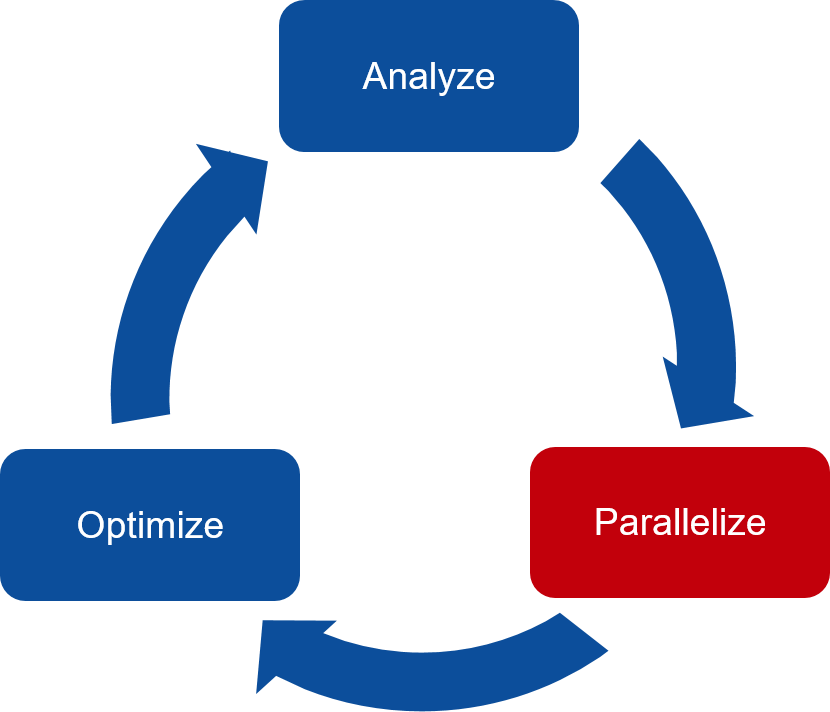

# Data Management with OpenACC

This version of the lab is intended for Fortran programmers. The C/C++ version of this lab is available [here](../C/README.md).

You will receive a warning five minutes before the lab instance shuts down. Remember to save your work! If you are about to run out of time, please see the [Post-Lab](#Post-Lab-Summary) section for saving this lab to view offline later.

Don't forget to check out additional [OpenACC Resources](https://www.openacc.org/resources) and join our [OpenACC Slack Channel](https://www.openacc.org/community#slack) to share your experience and get more help from the community.

---
Let's execute the cell below to display information about the GPUs running on the server. To do this, execute the cell block below by giving it focus (clicking on it with your mouse), and hitting Ctrl-Enter, or pressing the play button in the toolbar above.  If all goes well, you should see some output returned below the grey cell.


```bash
$ pgaccelinfo
```

---

## Introduction

Our goal for this lab is to use the OpenACC Data Directives to properly manage our data.We are going to use the same development cycle that we have used to this point. That is the 3-step development cycle.
  
  
  


This is the OpenACC 3-Step development cycle.

**Analyze** your code, and predict where potential parallelism can be uncovered. Use profiler to help understand what is happening in the code, and where parallelism may exist.

**Parallelize** your code, starting with the most time consuming parts. Focus on maintaining correct results from your program.

**Optimize** your code, focusing on maximizing performance. Performance may not increase all-at-once during early parallelization.

We are currently tackling the **parallelize** step. We will include the OpenACC data directive to properly manage data within our parallelized code.

---

## Run the Code (With Managed Memory)

In the previous lab, we ran our code with CUDA Managed Memory, and achieved a considerable performance boost. However, managed memory is not compatible with all GPUs, and it performs worse than programmer defined, proper memory management. Run the following script, and note the time the program takes to run. We are expecting that our own implementation will run a little bit better.


```bash
$ pgfortran -fast -ta=tesla:managed -Minfo=accel -o laplace_managed laplace2d.f90 jacobi.f90 && ./laplace_managed
```

### Optional: Analyze the Code

If you would like a refresher on the code files that we are working on, you may view both of them using the two links below.

[jacobi.f90](../../../../edit/module5/English/Fortran/jacobi.f90)  
[laplace2d.f90](../../../../edit/module5/English/Fortran/laplace2d.f90)  

### Optional: Profile the Code

If you would like to profile the code, you may select <a href="/vnc" target="_blank">this link.</a> When prompted for a password, type `openacc`. This will open a noVNC window, then you may use PGPROF to profile our laplace code. The executable will be found in the `/home/openacc/labs/module6/English/Fortran` directory.

---

## OpenACC Structured Data Directive

The OpenACC data directives allow the programmer to explicitly manage the data on the device (in our case, the GPU). Specifically, the structured data directive will mark a static region of our code as a **data region**.

```fortran
< Initialize data on host (CPU) >

!$acc data clauses

	< Sequential and/or Parallel code >

!$acc end data
```

Device memory allocation happens at the beginning of the region, and device memory deallocation happens at the end of the region. Additionally, any data movement from the host to the device (CPU to GPU) happens at the beginning of the region, and any data movement from the device to the host (GPU to CPU) happens at the end of the region. Memory allocation/deallocation and data movement is defined by which clauses the programmer includes. This is a list of the most important data clauses that we can use:

**copy** : `copy( A(1:N) )` : Allocates memory on device and copies data from host to device when entering region and copies data back to the host when exiting region  
**copyin** : `copyin( A(1:N) )` : Allocates memory on device and copies data from host to device when entering region  
**copyout** : `copyout( A(1:N) )` : Allocates memory on device and copies data to the host when exiting region  
**create** : `create( A(1:N) )` : Allocates memory on device but does not copy  
**present** : `present( A )` : Data is already present on device from another containing data region  

All of these data clauses (except for present) will allocate device memory at the beginning of the data region, and deallocate device memory at the end of the data region. And with the exception of create, they will also transfer some amount of data between the host and device.

You may also use them to operate on multiple arrays at once, by including those arrays as a comma separated list.

```fortran
!$acc data copy( A(1:N), B(1:M), C(1:Q) )
```

You may also use more than one data clause at a time.

```fortran
!$acc data create( A(1:N) ) copyin( B(1:M) ) copyout( C(1:Q) )
```

These clauses can also be used directly with a parallel or kernels directive, because every parallel and kernels directive is surrounded by an **implied data region**.

```fortran
!$acc kernels create(A(1:N)) copyin(B(1:M)) present(C(1:Q))

    < Code that uses A, B, and C >

```

### Encompassing Multiple Compute Regions

A single data region can contain any number of parallel/kernels regions. Take the following example:

```fortran
!$acc data copyin(A, B) create(C)

    !acc parallel loop
    for i=1,N
        C(i) = A(i) + B(i)
    enddo
    
    !acc parallel loop
    do i=1,N
        A(i) = C(i) + B(i)
    enddo

```

You may also encompass function calls within the data region:

```fortran
subroutine copy(A, B, N)
integer :: A(:), B(:), N

!$acc parallel loop copyout(A) copyin(B)
do i=1,N
   A(i) = B(i)
enddo

end subroutine copy


...

!$acc data copyout(A,B) copyin(C)
call copy(A, C, N);
    
call copy(A, B, N);
!$acc end data
```


But wouldn't this code now result in my arrays being copied twice, once by the data region and then again by the parallel loop inside the function calls? In fact, the OpenACC runtime is smart enough to handle exactly this case. Data will be copied in only the first time its encountered in a data clause and out only the last time its encountered in a data clause. This allows you to create fully-working directives within your functions and then later *"hoist"* the data movement to a higher level without changing your code at all. This is part of incrementally accelerating your code to avoid incorrect results.

### Array Shaping

The "array shape" defines a portion of an array. Take the following example:

```fortran
integer, dimension(:), allocatable :: A
allocate( A(N) )

!$acc data create( A )
```

The array shape is not defined, this means that the GPU copy will start at index 1, and be of size N (i.e. the entire array). However, you can specify a subset of the array using as A(2:N-1). Array shape is of the format **Array(starting_index:ending_index)**. Let's look at an example where we only want a portion of the array.

```fortran
integer, dimension(:), allocatable :: A
allocate( A(N) )

!$acc data create( A(1:N/2) )
```

In this example, the GPU copy will start at index 1, but will only be half the size of the CPU copy.

The shape of multi-dimensional arrays can be defined as follows:

```fortran
!$acc data create( A(1:N,1:M) )
```

If you do not include a starting index, then 1 is assumed. For example:

```fortran
!$acc data create( A(1:N) )
```

is equivalent to

```fortran
!$acc data create( A(:N) )
```

In Fortran, if you don't specify any of the indices, **starting_index** or **ending_index** then the compiler will assume you mean the entire array using the starting and ending indexes of the array on the CPU. An example is,

```fortran
!$acc data create( A )
```

### Host or Device Memory?

Here are two loops:

```fortran
integer, dimension(:), allocatable :: A
allocate( A(N) )

do i=1,N
    A(i) = 0
enddo

!$acc parallel loop
do i=1,N
    A(i) = 1
enddo
```

The first loop is not contained within an OpenACC compute region (a compute region is marked by either the parallel or kernels directive). Thus, `A(i)` will access host (CPU) memory.

The second loop is preceeded by the parallel directive, meaning that it is contained within an OpenACC compute region. `A(i)` in the second loop will access device (GPU) memory.

### Adding the Structured Data Directive to our Code

Use the following links to edit our laplace code. Add a structured data directive to properly handle the arrays **A** and **Anew**. 

[jacobi.f90](../../../../edit/module5/English/Fortran/jacobi.f90)   
[laplace2d.f90](../../../../edit/module5/English/Fortran/laplace2d.f90)  

Then, run the following script to check you solution. You code should run just as good as (or slightly better) than our managed memory code.


```bash
$ pgfortran -fast -ta=tesla -Minfo=accel -o laplace_structured laplace2d.f90 jacobi.f90 && ./laplace_structured
```

If you are feeling stuck, or would like to check your answer, you can view the correct answer with the following link.

[jacobi.f90](../../../../edit/module5/English/Fortran/solutions/advanced_data/structured/jacobi.f90)

### Optional: Profile the Code

If you would like to profile the code, you may select <a href="/vnc" target="_blank">this link.</a> This will open a noVNC window. If prompted for a password, type `openacc`. To create a new session, select File > New Session. In the "File" section, select "Browse". Locate our **laplace_structured** executable in the `/home/openacc/labs/module5/English/Fortran` directory. The select OK > Next > Finished. The code will take a few seconds to finish profiling.

Take a moment to explore the profiler, and when you're ready, let's zoom in on the very beginning of our profile.


We can see that we have uninterupted computation, and all of our data movement happens at the beginning of the program. This is ideal, because we are avoiding data transers in the middle of our computation.

---

## OpenACC Unstructured Data Directives

There are two unstructured data directives:

**enter data**: Handles device memory allocation, and copies from the Host to the Device. The two clauses that you may use with `enter data` are `create` for device memory allocation, and `copyin` for allocation, and memory copy.

**exit data**: Handles device memory deallocation, and copies from the Device to the Host. The two clauses that you may use with `exit data` are `delete` for device memory deallocation, and `copyout` for deallocation, and memory copy.

The unstructured data directives do not mark a "data region", because you are able to have multiple `enter data` and `exit data` directives in your code. It is better to think of them purely as memory allocation and deallocation.

The largest advantage of using unstructured data directives is their ability to branch across multiple functions. You may allocate your data in one function, and deallocate it in another. We can look at a simple example of that:

```fortran
subroutine intallocate(A,N)
    integer :: N
    integer, allocatable, dimension(:) :: A

    allocate( A(1:N) )
    !acc enter data create (A(1:N))
end subroutine intallocate

subroutine intdeallocate(A,N)
    integer :: N
    integer, allocatable, dimension(:) :: A

    !acc exit data delete(A(1:N))
    if (allocated(A)) deallocate(A)
end subroutine intdeallocate


program main
    integer, allocatable, dimension(:) :: A

    call intallocate(A,100)
    
    !acc parallel loop
    do i=1,100
        A(i) = 0
    enddo
    
    call intdeallocate(A,100)
end program main
```

Just like in the above code sample, you must first allocate the CPU copy of the array **before** you can allocate the GPU copy. Also, you must deallocate the GPU of the array **before** you deallocate the CPU copy.

### Adding Unstructured Data Directives to our Code

We are going to edit our code to use unstructured data directives to handle memory management. First, run the following script to reset your code to how it was before adding the structured data directive.


```bash
$ cp ./solutions/basic_data/jacobi.f90 ./jacobi.f90 && cp ./solutions/basic_data/laplace2d.f90 ./laplace2d.f90 && echo "Reset Finished"
```

Now edit the code to use unstructured data directives. To fully utilize the unstructured data directives, try to get the code working by only altering the **laplace2d.f90** code.

[jacobi.f90](../../../../edit/module5/English/Fortran/jacobi.f90)   
[laplace2d.f90](../../../../edit/module5/English/Fortran/laplace2d.f90)  

Run the following script to check your solution. Your code should run as fast as our structured implementation.


```bash
$ pgfortran -fast -ta=tesla -Minfo=accel -o laplace_unstructured laplace2d.f90 jacobi.f90 && ./laplace_unstructured
```

If you are feeling stuck, or would like to check your answer, you can view the correct answer with the following link.

[laplace2d.f90](../../../../edit/module5/English/Fortran/solutions/advanced_data/unstructured/laplace2d.f90)

### Optional: Profile the Code

If you would like to profile the code, you may select <a href="/vnc" target="_blank">this link.</a> This will open a noVNC window. To create a new session, select File > New Session. In the "File" section, select "Browse". Locate our **laplace_unstructured** executable in the /notebooks/Fortran directory. The select OK > Next > Finished. The code will take a few seconds to finish profiling.

Take a moment to explore the profiler, and when you're ready, let's zoom in on the very beginning of our profile.


We can see that we have uninterupted computation, and all of our data movement happens at the beginning of the program. This is ideal, because we are avoiding data transers in the middle of our computation. If you also profiled the structured version of the code, you will notice that the profiles are nearly identical. This isn't surprising, since the structured and unstructured approach work very similarly at the hardware level. However, structured data regions may be easier in simple codes, whereas some codes might flow better when using an unstructured approach. It is up to the programmer to decide which to use.

---

## OpenACC Update Directive

When we use the data directives, there exist two places where the programmer can transfer data between the host and the device. For the structured data directive we have the opportunity to transfer data at the beginning and at the end of the region. For the unstructured data directives, we can transfer data when we use the enter data and exit data directives.

However, there may be times in your program where you need to transfer data in the middle of a data region, or between an enter data and an exit data. In order to transfer data at those times, we can use the `update` directive. The update directive will explicitly transfer data between the host and the device. The `update` directive has two clauses:

**self**: The self clause will transfer data from the device to the host (GPU to CPU)  
**device**: The device clause will transfer data from the host to the device (CPU to GPU)

The syntax would look like:

`!$acc update self(A)`

`!$acc update device(A)`

All of the array shaping rules apply.

As an example, let's create a version of our laplace code where we want to print the array **A** after every 100 iterations of our loop. The code will look like this:

```fortran
!$acc data copyin(A(n,m), Anew(n,m))
do while (error > tol && iter < iter_max)
    error = calcNext(A, Anew, m, n)
    swap(A, Anew, m, n)
    
    if (mod(iter,100) == 0) then
        write(*,'(i5,f10.6)'), iter, error
        do i=1,n
            do j=1,m
                write(*,'(f10.2)', advance="no"), A(i,j)
            enddo
            write(*,*) ' '
        enddo
    endif

    iter = iter + 1
enddo
```

Let's run this code (on a very small data set, so that we don't overload the console by printing thousands of numbers).

Note: You will have to edit jacobi.f90 and change the dimensions of the problem from 4096 to 10. Otherwise the code will take a long time to run and it will produce a great deal of output to the screen.

**Once again**, please change the dimenions of the problem, `n` and `m` to 10. Originally the line in jacobi.f90 will be the following.

```fortran
integer, parameter :: n=4096, m=4096, iter_max=1000
```

That line in the jacobi.f90 now needs to look like the following

```fortran
integer, parameter :: n=10, m=10, iter_max=1000
```

The simple reason is that the Fortran code does not have command line argument capability while the C version does. Clicking on the links below will allow you to edit the code.

[jacobi.f90](../../../../edit/module5/English/Fortran/update/jacobi.f90)  
[laplace2d.f90](../../../../edit/module5/English/Fortran/update/laplace2d.f90)   


```bash
$ cd update && pgfortran -fast -ta=tesla -Minfo=accel -o laplace_no_update laplace2d.f90 jacobi.f90 && ./laplace_no_update
```

We can see that the array is not changing. This is because the host copy of `A` is not being **updated** between loop iterations. Let's add the update directive, and see how the output changes.

```fortran
!$acc data copyin( A(n,m), Anew(n,m))

do while (error > tol && iter < iter_max)
    error = calcNext(A, Anew, m, n)
    swap(A, Anew, m, n)
    
    if (mod(iter,100) == 0)
        write(*,'(i5,f10.6)'), iter, error
        
        !acc update self(A(n,m))
        do i=1,n
            do j=1,m
                write(*,'(f10.2)', advance="no"), A(i,j)
            enddo
        enddo
    endif
    iter = iter+1
    
end do
```

Note: You will have to edit jacobi.f90 and change the dimensions of the problem from 4096 to 10. Otherwise the code will take a long time to run and it will produce a great deal of output to the screen.

**Once again**, please change the dimenions of the problem, `n` and `m` to 10. Originally the line in jacobi.f90 will be the following.

```fortran
integer, parameter :: n=4096, m=4096, iter_max=1000
```

That line in the jacobi.f90 now needs to look like the following

```fortran
integer, parameter :: n=10, m=10, iter_max=1000
```

The simple reason is that the Fortran code does not have command line argument capability while the C version does. Clicking on the links below will allow you to edit the code.

[jacobi.f90](../../../../edit/module5/English/Fortran/update/solution/jacobi.f90)  
[laplace2d.f90](../../../../edit/module5/English/Fortran/update/solution/laplace2d.f90)   


```bash
$ cd update/solution && pgfortran -fast -ta=tesla -Minfo=accel -o laplace_update laplace2d.f90 jacobi.f90 && ./laplace_update
```

---

## Conclusion

Relying on managed memory to handle data management can reduce the effort the programmer needs to parallelize their code, however, not all GPUs work with managed memory, and it is also lower performance than using explicit data management. OpenACC gives the programmer two main ways to handle data management, structured and unstructured data directives. By using these, the programmer is able to minimize the number of data transfers needed in their program.

---

## Bonus Task

If you would like some additional lessons on using OpenACC, there is an Introduction to OpenACC video series available from the OpenACC YouTube page. The fifth video in the series covers a lot of the content that was covered in this lab.  

[Introduction to Parallel Programming with OpenACC - Part 5](https://youtu.be/0zTX7-CPvV8)  

## Post-Lab Summary

If you would like to download this lab for later viewing, it is recommend you go to your browsers File menu (not the Jupyter notebook file menu) and save the complete web page.  This will ensure the images are copied down as well.

You can also execute the following cell block to create a zip-file of the files you've been working on, and download it with the link below.


```python
%%bash
rm -f openacc_files.zip
zip -r openacc_files.zip *
```

**After** executing the above zip command, you should be able to download the zip file [here](files/openacc_files.zip)

# Licensing
This material is released by NVIDIA Corporation under the Creative Commons Attribution 4.0 International (CC BY 4.0).
